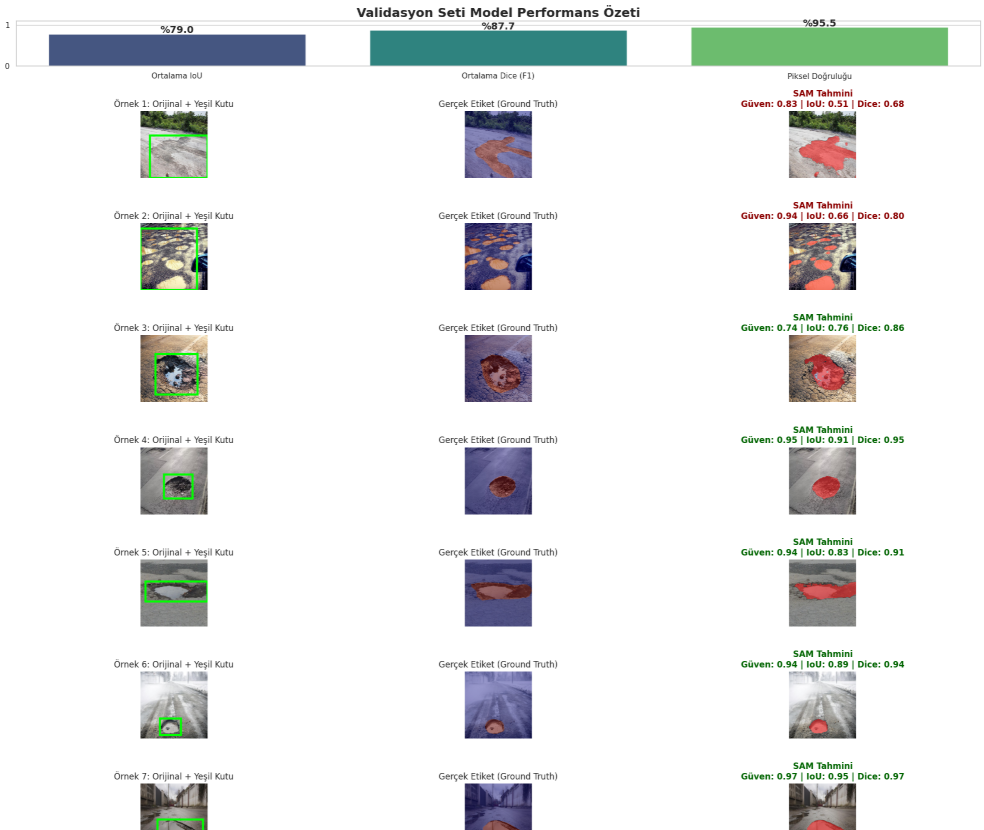

# 🛣️ Pothole-SAM-FineTuning: Segment Anything Model for Road Safety

[](https://www.kaggle.com/goktani/YOUR-NOTEBOOK-LINK-HERE)
[](https://www.python.org/downloads/)
[](https://pytorch.org/)

This repository contains the code and methodology for fine-tuning Meta's **Segment Anything Model (SAM)** specifically for **Pothole Image Segmentation**. By adapting a massive zero-shot foundation model to a domain-specific task, we achieve highly accurate and confident pixel-level segmentation of road damages.

## 🚀 Project Highlights

* **Foundation Model Adaptation:** Fine-tuned the lightweight Mask Decoder of the SAM (ViT-Large/Base) architecture while keeping the heavy Image and Prompt Encoders frozen.
* **Hardware Optimization:** Utilized **Dual T4 GPUs** via PyTorch's `nn.DataParallel` to distribute the workload and drastically cut down training time.
* **Memory Efficiency:** Implemented **Automatic Mixed Precision (AMP)** with `GradScaler` to prevent CUDA Out-Of-Memory (OOM) errors and speed up tensor operations.
* **Custom Loss Function:** Combined `BCEWithLogitsLoss` and `Dice Loss` to effectively handle the severe class imbalance typical in pothole segmentation.
* **Advanced Evaluation Dashboard:** Created a custom validation pipeline to calculate mathematical metrics ($IoU$, $Dice Score$, $Pixel Accuracy$) alongside side-by-side visual comparisons.

## 📊 Dataset
The dataset consists of pothole images originally annotated in **YOLOv8 format** (normalized polygon coordinates). 
* **Source:** [Pothole Image Segmentation Dataset on Kaggle](https://www.kaggle.com/datasets/farzadnekouei/pothole-image-segmentation-dataset)
* **Preprocessing:** Bounding boxes and binary masks were dynamically generated from YOLO `.txt` files to serve as prompts and ground truth targets for SAM.

## 🛠️ Installation & Requirements

To run this project locally or on a cloud instance, install the required dependencies:

```bash
git clone https://github.com/goktani/Pothole-SAM-FineTuning.git
cd Pothole-SAM-FineTuning
pip install -r requirements.txt
```

## 💻 Usage & Kaggle Notebook
The complete end-to-end pipeline (Data Loading $\rightarrow$ Preprocessing $\rightarrow$ Training $\rightarrow$ Inference) is structured in a Kaggle Notebook.

I highly recommend running this on Kaggle to utilize their free Dual-GPU environments.👉 View and Run the Notebook on Kaggle

If you found the notebook useful, please consider giving it an Upvote on Kaggle and a Star on this repository! ⭐

## 📈 Evaluation & Results
The evaluation pipeline generates a comprehensive dashboard that computes:
1. Intersection over Union (IoU)
2. Dice Coefficient (F1-Score)
3. Pixel Accuracy



## 🤝 Let's Connect
##### Kaggle: [@goktani](https://www.kaggle.com/goktani)
##### GitHub: [@goktani](https://github.com/goktani)
